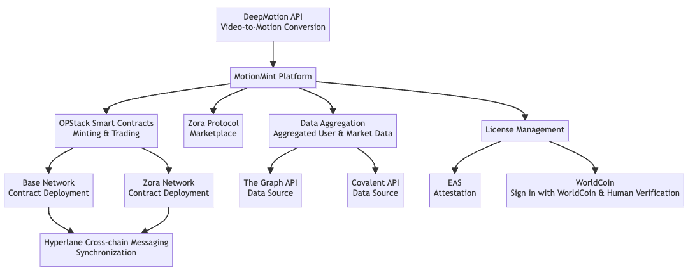

# Motion Mint

Transforming Videos into Certified Motion Data with AI.

## Description

MotionMint, where videos do more than play, they transform. Our advanced AI turns videos into motion data, and each motion is stamped with trust, coming from verified creators attestaion.

## Live Demo

https://motion-mint.vercel.app/

## Demo Video

TBS

## Benefit

1. Seamless Conversion: Transform videos into motion data effortlessly with cutting-edge AI.
2. Monetization Opportunity: Unlock new revenue streams by selling motion data rights.
3. Showcase & Share: A dedicated platform to display, gain recognition, and connect with a like-minded community.

## Technical Detail

### DeepMotion API

MotionMint leverages the **DeepMotion API** for the core functionality of video-to-motion data conversion. This advanced AI-driven service is responsible for the seamless transformation of video content into rich motion data, ensuring high accuracy and quality.

### OPStack Smart Contracts

The underlying smart contracts of MotionMint, are deployed on **Optimism** the **Base** and **Zora** networks. These contracts facilitate the minting, trading, and attestation of motion data, ensuring decentralized and transparent transactions.

And trustworthy creator verification of AI-based content is crutial for tuture ecosystem.

### Zora Protocol NFT and Marketplace

The marketplace where creators can monetize their motion data is built upon the **Zora Protocol**. This ensures a decentralized, transparent, and fair pricing mechanism for the motion data, allowing creators to capture more value from their work.

### Worldcoin Proof of Personhood

- **WorldCoin**: This service allows users to sign in with WorldCoin and also provides human verification functionalities, ensuring genuine user interactions.

### EAS Attestation

- **EAS (Ethereum Attestation Service)**: Used to manage the attestation of motion data. It ensures that provides a mechanism for verification of rights and ownership.

#### Optimism schema

https://optimism-goerli-bedrock.easscan.org/schema/view/0x97e1d46622e995367fa950d673c978650f37303fb7feabe0041e3b8d5e554c17

#### Base schema

https://base-goerli.easscan.org/schema/view/0x97e1d46622e995367fa950d673c978650f37303fb7feabe0041e3b8d5e554c17

#### Zora schema

EAS does not support Zora.

### LayerZero Cross-chain Messaging

Given the multi-chain nature of MotionMint's deployment, **LayerZero Cross-chain Messaging** is employed to ensure synchronization between the Base and Zora networks. This ensures that data and transactions are consistent and updated across different blockchain networks.

#### Optimism -> Base

https://goerli-optimism.etherscan.io/tx/0x752d39b86016b5c6400ab2047dbca3926e6f7ad1e5a815dda8ed7199c22c748f

https://testnet.layerzeroscan.com/10132/address/0xfea0aee6d6fe4640ebef38be713cbeacf1deb549/message/10160/address/0x4a917ec1917484d9c9aa196742d1588705320b91/nonce/1

#### Base -> Optimism

https://goerli.basescan.org/tx/0x53e6d64b120ef20d4e79e34de52182ad922a97f12bf700c8dbcddf15fd4ec77f

https://testnet.layerzeroscan.com/10160/address/0x4a917ec1917484d9c9aa196742d1588705320b91/message/10132/address/0xfea0aee6d6fe4640ebef38be713cbeacf1deb549/nonce/1

#### Zora

LayerZero does not support Zora.

## Created NFT

### Optimism

https://testnet.zora.co/collect/ogor:0xc2a3427a1b9205948a020ea542ae8d92cb53ac6e

### Base

https://testnet.zora.co/collect/basegor:0xe253e01b5d0aaaed147102f37c7a5f78b44fa640

### Zore

https://testnet.zora.co/collect/zgor:0x2ea74d363b9555e30bf592a3be8a2279ceb0afe1
