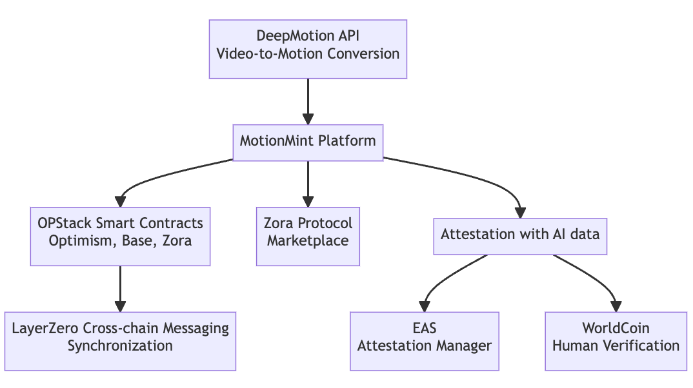

# Motion Mint

## Tagline

Motion, Mint, Monetize: The Future of Motion Data.

## Short Description

MotionMint is where videos evolve into valuable motion data, enabling creators to showcase, share, and monetize their dynamic artistry.

## Long Description

MotionMint is revolutionizing the way we perceive and utilize video content. By harnessing the power of advanced AI, it effortlessly converts videos into rich motion data. But it doesn't stop there. Creators are given a unique platform to not only showcase and share their motion masterpieces but also to monetize them. Dive into the future of motion data, where every movement holds value and potential.

## Benefit

1. Seamless Conversion: Transform videos into motion data effortlessly with cutting-edge AI.
2. Monetization Opportunity: Unlock new revenue streams by selling motion data rights.
3. Showcase & Share: A dedicated platform to display, gain recognition, and connect with a like-minded community.

## Technical Detail

### DeepMotion API

MotionMint leverages the **DeepMotion API** for the core functionality of video-to-motion data conversion. This advanced AI-driven service is responsible for the seamless transformation of video content into rich motion data, ensuring high accuracy and quality.

### OPStack Smart Contracts

The underlying smart contracts of MotionMint, known as **OPStack Smart Contracts**, are deployed on both the Base and Zora networks. These contracts facilitate the minting, trading, and licensing of motion data, ensuring decentralized and transparent transactions.

### Zora Protocol

The marketplace where creators can monetize their motion data is built upon the **Zora Protocol**. This ensures a decentralized, transparent, and fair pricing mechanism for the motion data, allowing creators to capture more value from their work.

### License Management

Licensing and rights management are crucial aspects of MotionMint. The **License Management** system integrates:

- **EAS (Ethereum Attestation Service)**: Used to manage the licensing of motion data. It ensures that licensing terms are adhered to and provides a mechanism for verification of rights and ownership.

#### Created Schema

https://optimism-goerli-bedrock.easscan.org/schema/view/0x97e1d46622e995367fa950d673c978650f37303fb7feabe0041e3b8d5e554c17

- **WorldCoin**: This service allows users to sign in with WorldCoin and also provides human verification functionalities, ensuring genuine user interactions.

### LayerZero Cross-chain Messaging

Given the multi-chain nature of MotionMint's deployment, **Hyperlane Cross-chain Messaging** is employed to ensure synchronization between the Base and Zora networks. This ensures that data and transactions are consistent and updated across different blockchain networks.

### Optimism -> Base

#### Source chain exproler

https://goerli-optimism.etherscan.io/tx/0x6e60e9bfc79cdeac5a1f95e0af39d9f65d89780b3771961466e48a97e6034152

#### LayerZero Exproler

https://testnet.layerzeroscan.com/10132/address/0xf989e98e1cc730fc4b4d4754baf83892218fd09f/message/10160/address/0xf1b98dd8ff1592bbae96a96bd6261ffa5eb90301/nonce/1

### Base -> Optimism

#### Source chain exproler

https://goerli.basescan.org/tx/0x776b38d1b87d33111b1054b26d4d022cd79fe9289e3baff9c363c768df90adb3

#### LayerZero Exproler

https://testnet.layerzeroscan.com/10160/address/0xf1b98dd8ff1592bbae96a96bd6261ffa5eb90301/message/10132/address/0xf989e98e1cc730fc4b4d4754baf83892218fd09f/nonce/1

### Data Aggregation

To provide users with a comprehensive view of their activities, earnings, and the broader market dynamics, MotionMint integrates both **The Graph** and **Covalent APIs**. These services aggregate data from various sources, presenting it in a user-friendly manner, aiding in decision-making and strategy formulation.

By combining these technologies, MotionMint offers a robust, decentralized platform for creators to monetize their motion data, ensuring transparency, security, and ease of use.
